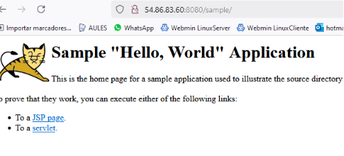

**UD5** 

**Second Term Assessable Activity** 

**Alfonso Arnal Hernandez**

0. Initial Preparation: AWS Account

url ec2: <https://us-east-1.console.aws.amazon.com/ec2/home?region=us-east-1#Home>:

url s3bucket: <https://us-east-1.console.aws.amazon.com/s3/buckets/alfonso-s3-ceed?region=us-east-1>

1. **Create an EC2 instance**

Following the instructions in the Amazon Web Services guide, I was able to create an Ubuntu Server in the virtual machine, open the necessary ports to connect remotely through ssh, and also to be able to connect through the http, https and java ports.

C:\Users\Alumnado\Documents\daw\aws>ssh -i labsuser.pem [ubuntu@ec2-18-206-137- 42.compute-1.amazonaws.com](mailto:ubuntu@ec2-18-206-137-42.compute-1.amazonaws.com)

ec2-44-202-66-171.compute-1.amazonaws.com 54.86.83.60 

From one day to the next my public IP address has changed, but it connects to the same pem file. It changes every time I turn the lab on and off.

To perform the update operation and package installation, I log in through my computer with a terminal to the cloud server with ssh, the installed packages are

apache2, tomcat10, tomcat10-admin (9 gave an error), nodejs, npm, pm², express, zip

It seems more like downloading the zip of the complete project from git and unzipping it, then installing the dependencies and running it

I check that all apache, tomcat, batleship and counterapp applications work

Loading the files has been quite simple following the instructions in the manual and the tutorials...we'll see in the exam

I have managed to configure proxypass and proxypassreverse so that it shows the vite page when you access the server's IP

In order to solve the problem of access to the vite application instead of changing it in the json (because I had not seen the tc yet) I changed the server address in the vite.config.js file and it worked well

I have managed to configure the elastic IP and associate it with my instance (I realized this at the end of the exercise)

The applications work the same, only I have to change the IP address that I have to access from my computer 

2. **Deploy a React Application on an Amazon S3 Bucket**

   I followed the instructions in the Akash Ingole user guide to create the S3 bucket we activate the property to allow web services hosting

   Within the permissions we disable the public block

   add bucket policy for our access

   Upload the application files that we are going to deploy 

   We check that the files were uploaded correctly

   and finally we go to the properties to access the website

   <http://alfonso-s3-ceed.s3-website-us-east-1.amazonaws.com/>

3. **repository on GitHub**

url github: <https://github.com/AlfZun/Assessable_Activity2_WAD_2024_25>

include a brief description of the steps 

4. **private video**

url youtube:

https://youtu.be/9CYymq14xZw
